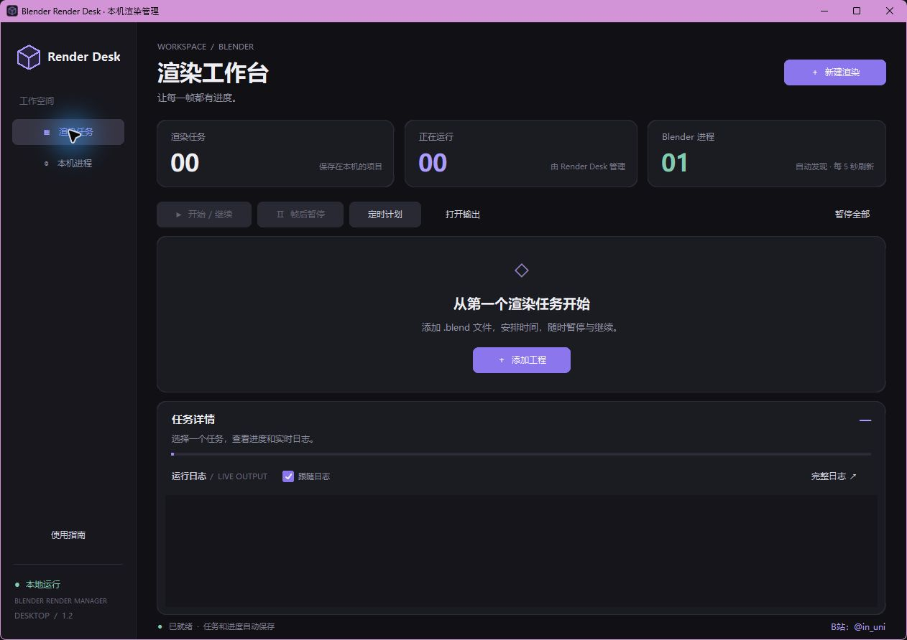

# Blender Render Desk

一个 Windows 独立渲染管理程序，主要用于管理通过命令行或 Python 脚本启动的 Blender 后台渲染。

不用打开 Blender 的图形界面，也能直接发起渲染、查看实时进度和资源占用、按帧暂停与继续，以及安排开始和暂停时间。后台渲染减少了编辑器窗口和视口带来的额外资源开销，具体节省量取决于工程与使用情况。

无需安装 Blender 插件；电脑仍需安装 Blender，实际渲染由 Blender 后台进程完成。暂停并保存当前帧后，后台进程退出，释放其占用的资源，之后可以重新启动并继续剩余帧。

**[B站：@in_uni](https://space.bilibili.com/1856651886/)**

[下载 Windows 版](https://github.com/pan0001/BlenderRenderDesk/releases/latest)



## 1.3.1 性能优化

- 只查询 Blender 的进程详情，避免扫描所有程序的命令行。
- 任务检查、调度、开始和暂停操作移到后台；界面通过快照显示状态。
- 日志只读取和追加新内容，表格只更新发生变化的行。界面限制可见日志长度，完整记录保存在日志文件中。
- 外部输出目录只检查已有文件，不逐一查找所有尚未渲染的帧。

## 1.3 功能更新

- 任务和本机进程列表显示完成帧数 / 百分比、本次运行时长、CPU 和内存。
- CPU 按整机逻辑核心总算力归一化，内存为进程工作集；进程列表约每 2 秒刷新，首次 CPU 采样可能为 0。
- 支持接入已有的逐帧 PNG 后台脚本，暂停、继续、定时，并统一到任务列表管理。
- 外部进程未确认输出目录和帧范围前，进度显示“待接入识别”。百分比按完成帧数计算，不代表单帧采样进度。
- 底部署名可直接打开 B站个人主页。

### 界面修复

- 替换系统滚动条为深色圆角滚动条，内容未溢出时自动隐藏。
- 进度条改为自绘细条，移除旧式立体边框。
- 页面改用无边框容器，移除任务区域的浅色外框。
- 底部增加作者署名。

## 1.1 界面更新

- 深灰 / 紫色主题，统一圆角按钮与表单，专用应用图标。
- 左侧导航切换渲染任务和本机进程。
- 顶部状态卡显示任务、运行任务和本机 Blender 数量。
- 任务详情、完成百分比、进度条和实时日志集中展示。
- 保存记录、管理事件和错误日志分别着色；支持拖动任务表与日志之间的分隔条。
- 空任务引导、自动选中任务、较小窗口布局与深色标题栏。
- 原任务数据和渲染控制逻辑兼容，不需要迁移数据。

## 快速使用

1. 双击 `BlenderRenderDesk.exe`。请保留同目录的 `_internal` 文件夹。
2. 点“新建渲染”，选择保存好的 `.blend`。程序自动寻找 Blender，也可手动浏览。
3. 点“读取工程范围”，或手动设置起始帧、结束帧、步长。选择 PNG / OPEN_EXR 和输出父目录。
4. 创建任务，选中任务后点“开始 / 继续”。任务不会在创建时自动渲染。
5. 点“帧后暂停”，程序等当前帧保存后退出该 Blender 后台进程。看到“已暂停 · 进程已退出”即可稍后继续。
6. 点“定时计划”，设置多少分钟后开始、暂停，或指定本地日期时间。留空是不安排相应动作。新计划替换旧计划。
7. 下方显示 Blender 实时输出与错误。可打开完整日志和输出目录。

## 保存和续渲染

- 每个任务使用独立输出子目录，完成帧以 `frame_000001.png` / `.exr` 命名。
- 主画面先保存到临时文件，完成后提交为最终帧并持久保存进度。未完成帧在续渲染时重算。
- 暂停不是把正在算到一半的单帧保存成可恢复状态。暂停发生在帧边界；到定时时刻后可能还需等当前帧完成。
- 可以退出管理器再打开。已启动的 Blender 会继续执行；重新打开管理器可恢复对这些托管进程的控制和日志显示。
- 已完成图片被删除后，续渲染会补渲染缺失帧；已完成图片大小被更改时停止并报错，避免覆盖。检查并恢复该图片，或新建任务。
- 工程文件大小或修改时间变化时拒绝续渲染，需新建任务。外部贴图、链接库、缓存等依赖资源无法自动快照，请在任务期间保持不变。
- 不修改或另存原始 `.blend`；保留原工程位置，以正确解析相对资源路径。

## 接入已有进程

“本机进程”自动列出可见 Blender 进程、PID、帧进度、CPU、内存、运行时间和命令行。选择进程 → “接入选中进程” → 确认真实 PNG 输出目录、文件名规则（如 `####.png`）、起止帧与步长。

- **托管进程**：本程序启动，可按帧暂停、继续、定时和读取日志。
- **外部脚本进程**：当前支持 `-b 工程.blend --python 脚本.py`，脚本同步调用 `bpy.ops.render.render(write_still=True)`，逐帧输出单视图 PNG，输出目录和帧范围只属于这个任务。脚本需要能够重新执行，不能在初始化时清空已有输出。
- **首次暂停的区别**：旧进程没有协作控制，因此管理器检测到下一张 PNG 完整写入（检查结构、CRC 和 IEND）后结束该进程。检测有延迟，可能丢弃刚开始的下一帧计算；完整图片仍保留。这一观察与停止过程需要管理器保持运行。
- **继续之后**：使用原脚本、参数和工作目录重新启动，通过桥接脚本实现真正的帧边界协作暂停，保存后正常退出。保留并跳过完整帧，未完成的 PNG 改名留存再重算。
- **日志**：无法补接原进程已经打开的 stdout。初次接入记录图片保存事件；重新启动后显示完整 Blender / 脚本输出。
- **其他进程**：有编辑窗口的 Blender、直接 `-a` 动画命令、视频输出及其他未支持脚本只显示资源和时长。不会关闭编辑窗口或假报其渲染百分比。
- “从工程新建”仅提取 `.blend` 路径，不复制外部脚本和参数，适合新建独立任务。不要让多个任务共用合成器输出位置。

## 定时规则

- 定时由管理器执行，**需要程序保持运行、电脑保持唤醒**，不唤醒关机或睡眠的电脑，不注册系统服务。
- 可以仅设置暂停已有托管任务，也可同时设置稍后开始和暂停。
- 关闭再打开时，已过期的开始计划会补执行；如果暂停时间也已过，跳过过期渲染窗口。
- 手动暂停会清除此任务的待执行计划，避免暂停后又被旧计划启动。
- 多个任务可同时渲染；目前不限制并行数量，请按内存和显存容量启动。

## 支持范围

- 测试环境：Windows / Blender 5.1。使用工程的活动场景、相机、引擎、分辨率；GPU/CPU 沿用工程和 Blender 用户配置。
- 主输出为 PNG 或单层 OPEN_EXR 图片序列；不直接渲染 MP4。需要视频时可用 Blender 视频序列编辑器另行合成。
- 合成器 File Output 节点仍使用工程原路径，需自行确保空间和命名正确。多视图 / 立体渲染当前明确报错，不会误报完成。
- 模拟需预烘焙，依赖第三方插件或自定义驱动的工程需先验证。工程内 Python 自动执行默认关闭，可信工程可在创建任务时启用。
- `.blend` 文件可能很大，“读取工程范围”会短暂启动一个后台 Blender，最多等待 90 秒。
- 本程序未提供任意外部进程热接管、视频合成、云同步或跨电脑调度。

## 数据与源码

默认数据目录为 `%LOCALAPPDATA%\BlenderRenderDesk`。每个任务目录保存配置、进度、进程身份、状态和 `render.log`。软件移动位置不影响这些记录。日志可能包含本机路径。

源码运行：`python app.py`（先安装 `requirements.txt`，Python 需包含 Tk）。

构建可分发程序：

```powershell
pip install -r requirements.txt
./build.ps1
```

验证：`python -m unittest discover -p "test_*.py"`。Windows / Blender 5.1.2 已实测新任务的定时、按帧退出、续渲染、缺失帧补渲染，以及外部脚本的接入、首次停止、桥接续渲染与再次按帧暂停；校验已完成图片保持不变。

可以用 `--data-dir <目录>` 指定隔离的数据目录进行测试。
