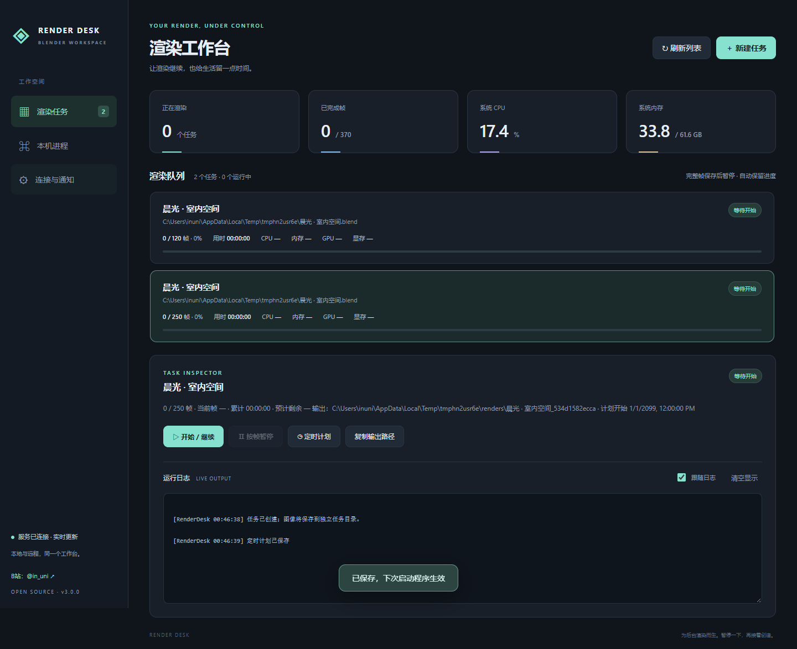
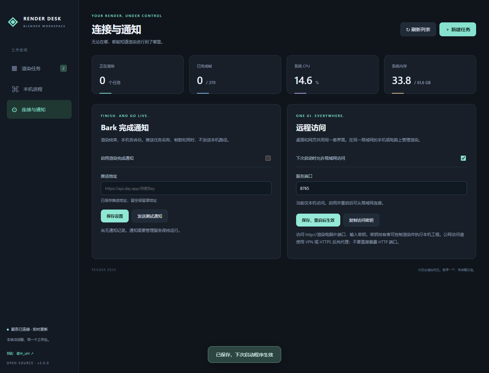

# Blender Render Desk 3

**GPT 帮你开始渲染，Render Desk 帮你看清进度；想上号时暂停一下，渲染完成让 Bark 告诉你。**

独立的 Blender 后台渲染管理器。主要管理命令行、Python 脚本或 AI 助手启动的渲染，无需打开 Blender 图形界面，电脑仍需安装 Blender。

渲染到一半，原神、星穹铁道每日还没做，或朋友突然喊你开黑？点“按帧暂停”，当前帧保存后退出 Blender，腾出资源。回来后继续剩余帧。

[B站：@in_uni](https://space.bilibili.com/1856651886/) · MIT 开源 · 不设试用期



## 3.0 更新

- **一套网页 UI**：pywebview 桌面窗口与浏览器使用同一份 HTML / CSS / JS、同一个 HTTP API，不维护两套界面。
- **远程管理**：可同时用手机、另一台电脑查看进度、资源、日志，创建任务、按帧暂停、继续和定时。远程默认关闭，接口需要访问密钥。
- **Bark 完成通知**：设置推送地址，渲染结束自动提醒；后台发送，持久队列，最多尝试三次，完成事件去重。
- **分层目录**：界面、服务、渲染执行器、测试、构建和文档各有目录。
- 保留 SQLite 任务目录、PNG / OpenEXR、帧 SHA256 校验、缺失帧补渲染、旧任务导入与进程接入。

## Windows 使用

完整解压 Windows 压缩包，运行 `BlenderRenderDesk.exe`。保留 `_internal` 目录。桌面端需要 Microsoft Edge WebView2 Runtime（现代 Windows 通常已有）；源码服务器模式不需要 WebView2。

1. 点击“新建任务”，选择 Blender 程序、保存好的 `.blend` 和输出目录，填写帧范围。
2. 创建后点击“开始 / 继续”。每项任务使用独立输出子目录。
3. 按帧暂停等待当前帧保存后退出 Blender，恢复会重新加载工程并跳过完成帧。
4. “连接与通知”中配置 Bark，或启用局域网访问（重启后生效）。

桌面端可浏览本机文件；远程端填写的是**渲染电脑上的路径**，不是手机或访问者电脑上的路径，不会上传工程。多台设备看到同一份任务目录，调度只运行一次。进度按完整帧计算，不是单帧内部采样百分比。未接入的进程没有可靠帧信息时不伪造进度。

## Bark

在“连接与通知”填写 `https://api.day.app/你的Key`，勾选启用并保存，再点“发送测试通知”。可填写自建 Bark 服务的设备推送地址。留空保存会保留原地址。



通知包含任务名称、完成帧数和累计用时，不发送本机路径。首次导入不推送已完成的历史任务；此后观察到任务完成才入队。首次失败约 15 秒后重试，再失败约 30 秒后重试，最多三次。设置页显示最近发送状态。Bark 的成功响应只表示服务接收，不能保证手机当时在线或系统一定展示通知。网络响应丢失或发送后意外崩溃时，重试可能产生重复推送。

**通知需要管理服务保持运行。** 关闭桌面管理器会停止它的 HTTP 服务、通知和定时启动，但不会结束 Blender。若希望关闭窗口后继续管理，请使用下面的独立服务器模式。若管理器停机期间任务完成，重新开启后可检测已跟踪任务的完成并补发通知。

地址保存在数据目录 `bark.json`，包含设备密钥；访问密钥在 `access-token.json`。两者均为本机明文配置，不会随源码或便携包分发，API 不返回 Bark 地址。不要公开或分享这些文件。

## 远程 / 服务器模式

在设置页启用局域网访问并重启后，用其他设备访问 `http://渲染电脑IP:8765`，输入“复制访问密钥”获得的密钥。端口可配置；防火墙需允许对应网络访问。程序不会自动修改防火墙或路由器。

源码也可单独运行服务，完全不启动桌面窗口：

```powershell
python app.py --server --remote --port 8765
```

省略 `--remote` 且未在设置中启用远程时仅监听本机。服务器模式将访问地址与密钥文件位置打印到终端，按 Ctrl+C 停止。已启用远程时，桌面启动也会同时提供网页服务。所有客户端轮询同一份缓存快照；操作通过串行队列执行，日志游标互相独立。

密钥持有者可运行渲染电脑上的工程与受支持脚本，应仅给可信人员。局域网 HTTP 不加密流量；公网请通过 VPN 或配置正确的 HTTPS 反向代理访问，不要直接公开端口。程序不提供云中继、用户角色或多人权限管理。

## 已有 Blender 进程

支持接入单个 `--python` 脚本同步调用 `bpy.ops.render.render(write_still=True)`、逐帧输出单视图 PNG 的后台任务。确认真实输出目录、帧范围与文件名模板，例如 `####.png`。原脚本必须可重跑，不能在初始化时清空已有输出。

首次暂停检测下一张 PNG 完整保存后结束原进程，可能丢弃随后开始的一帧计算；之后续渲染使用协作执行器，跳过完成帧并在帧边界退出。原进程的历史 stdout 无法补接；继续后保存完整输出。编辑窗口、直接 `-a` 动画命令、视频输出和其他不支持的进程仅可监测。

## 数据与升级

默认 `%LOCALAPPDATA%/BlenderRenderDesk`。3.0 沿用 2.0 的 `renderdesk-v2.sqlite3` 与 `jobs/`，新增通知队列和连接设置，不移动工程或图片。升级先关闭旧管理器，再打开新版。若旧版用了 `--data-dir`，新版必须指定同一路径，例如：

```powershell
BlenderRenderDesk.exe --data-dir "D:/MyRenderTasks"
```

已运行的 Blender 通过 PID 和创建时间识别。已完成文件摘要异常时拒绝覆盖，缺失帧可补渲染；修改工程后应新建任务。合成器额外输出不在主图像的逐帧校验范围，模拟应提前烘焙。暂停保存完整帧和任务状态，不保存计算到一半的 GPU 内存。

## 性能

后台模式使用相同 Blender 渲染引擎，省去图形界面与视口可能减少额外开销，但不承诺固定提速比例。暂停退出能释放该进程资源，恢复则有重新加载工程和缓存的成本。[Blender 后台命令行](https://docs.blender.org/manual/en/latest/advanced/command_line/arguments.html)。

CPU 按整机逻辑核心归一化，内存为工作集；GPU 为该进程最忙引擎的计数器读数，显存为专用显存计数器。Windows 驱动不提供有效采样时显示“—”。

## 开发目录

```text
app.py                 简短启动入口
renderdesk/
  app.py               pywebview 窗口 / 服务器生命周期
  server.py            HTTP API、鉴权与静态资源
  runtime.py           单一任务控制线程与快照
  notifications.py     Bark 推送与持久通知队列
  service.py           调度、暂停、续渲染和接入
  storage.py           SQLite 任务目录
  processes.py         进程与资源采样
  engine/              Blender 执行器与文件协议
  web/                 唯一一套 HTML / CSS / JS 界面
tests/                 后端、HTTP、浏览器与真实 Blender 测试
scripts/               Windows 构建脚本
assets/                图标与界面截图
docs/                  来源、依赖与验证说明
licenses/              第三方许可文本与元数据
```

Python 3.10+；本次验证 Windows / Python 3.13 / Blender 5.1.2。

```powershell
python -m venv .venv
.\.venv\Scripts\python -m pip install -r requirements.txt
.\.venv\Scripts\python app.py
.\.venv\Scripts\python -m unittest tests.test_engine tests.test_web -v
.\.venv\Scripts\python -m tests.test_blender_integration
# 可选网页测试，使用已安装的 Edge：
.\.venv\Scripts\python -m pip install playwright
.\.venv\Scripts\python -m tests.test_browser
.\scripts\build.ps1 -Python .\.venv\Scripts\python.exe
```

独立原创代码使用 [MIT](LICENSE)。[实现来源](docs/PROVENANCE.md)、[依赖声明](docs/THIRD_PARTY_NOTICES.md)、[验证记录](docs/验证记录.md)。pywebview 与 Bark 的对接分别参考 [pywebview API](https://pywebview.flowrl.com/api/) 和 [Bark 官方文档](https://github.com/Finb/Bark/blob/master/README.zh.md)。
